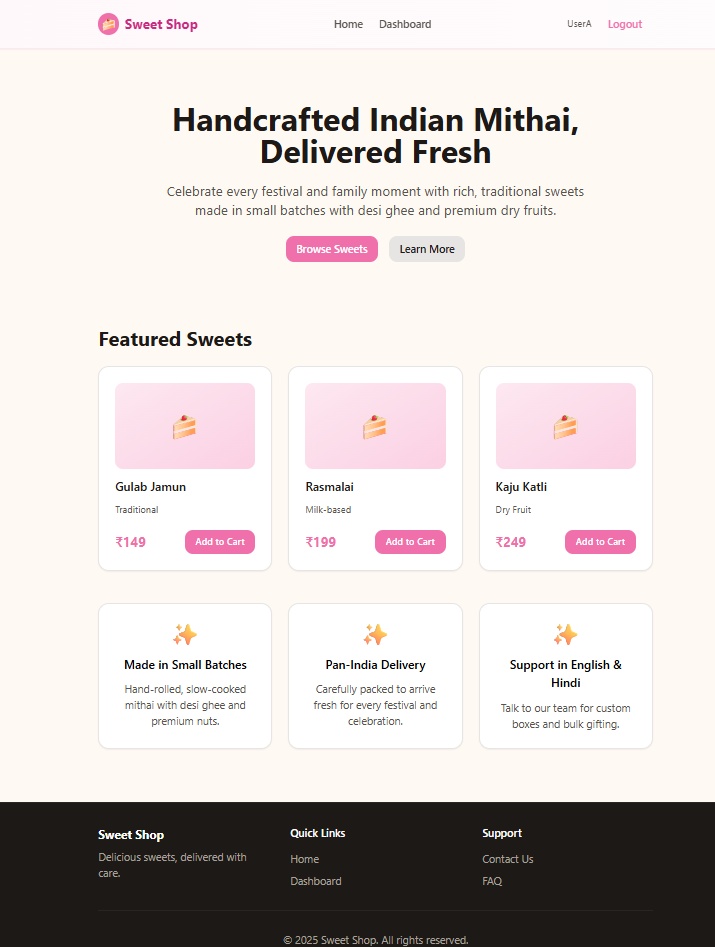
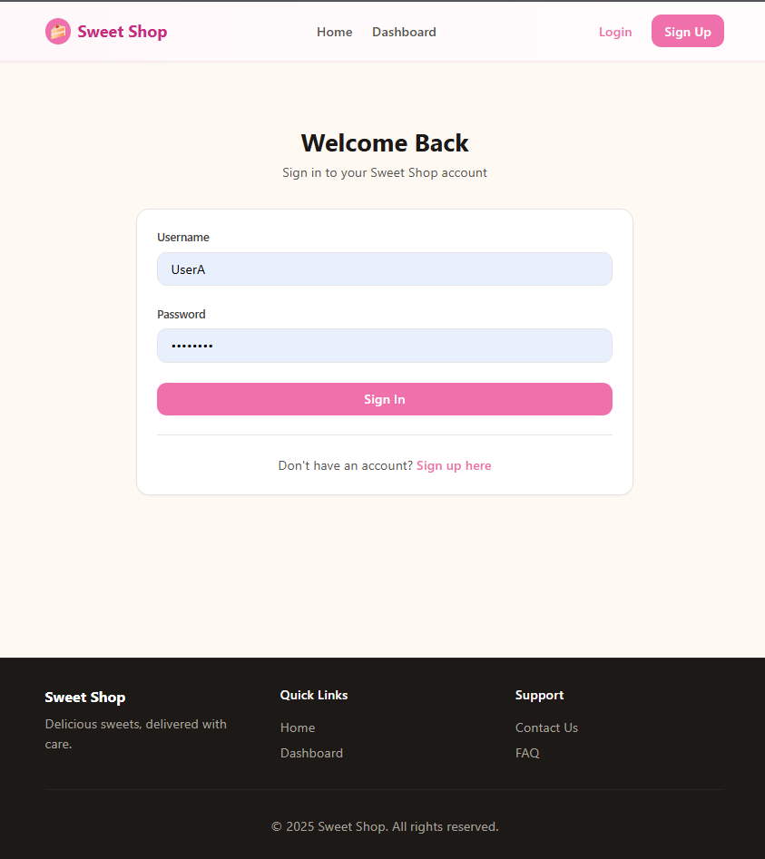
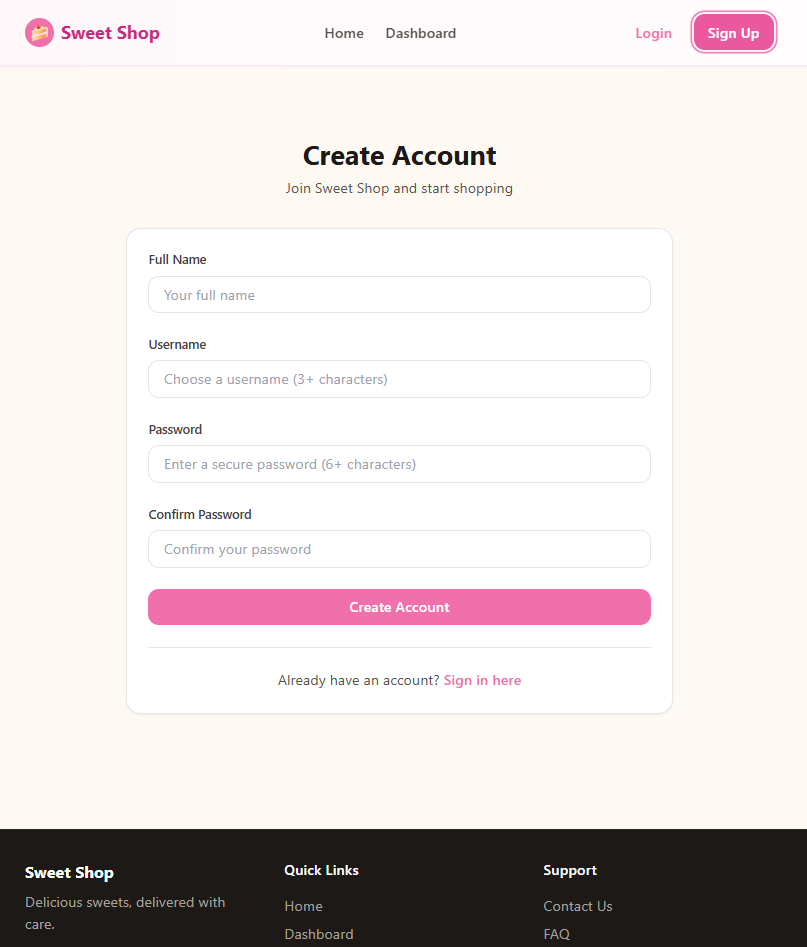
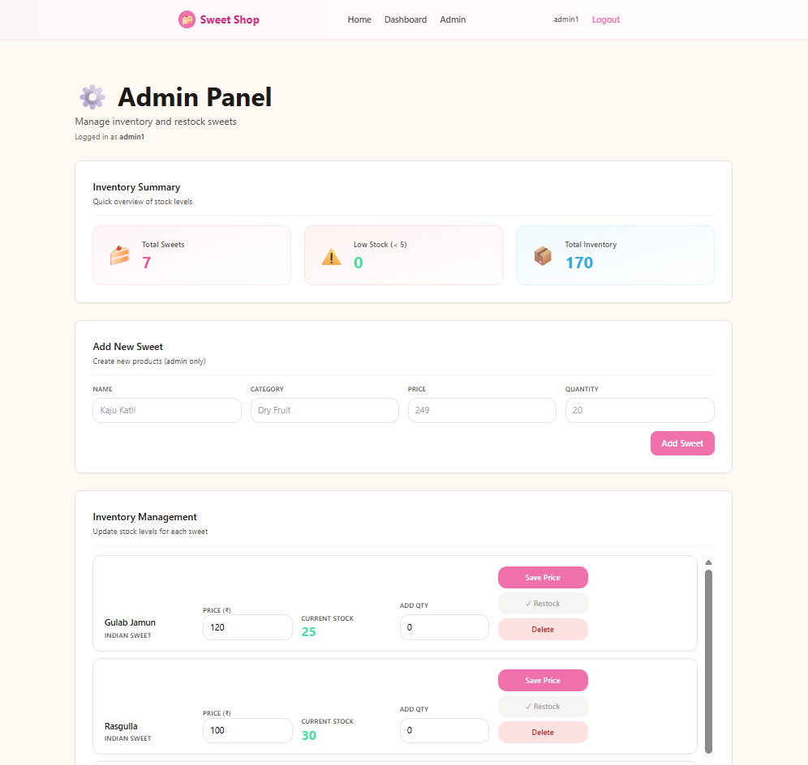
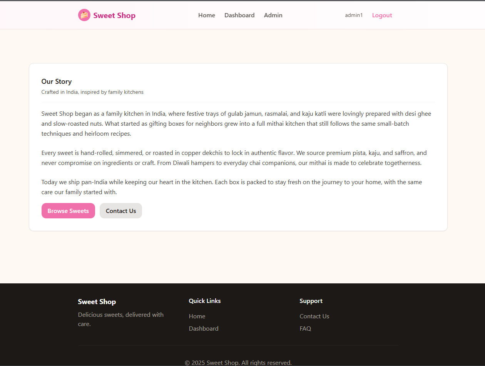
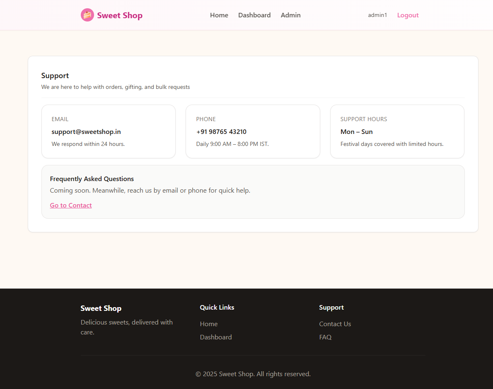
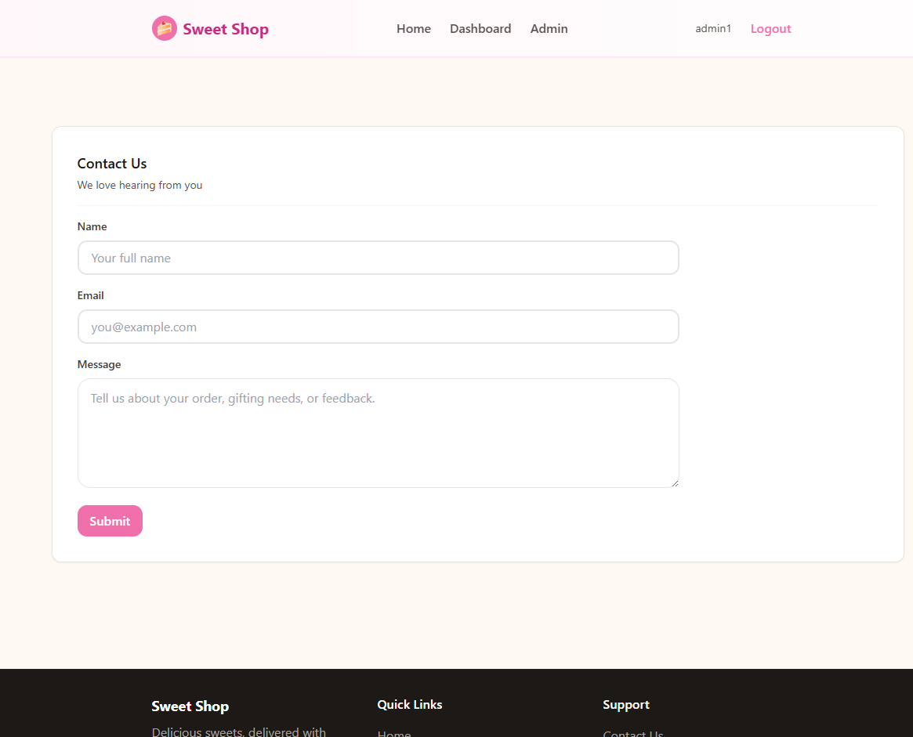

# 🍬 Sweet Shop Management System

A **production-ready full-stack Sweet Shop Management System** built using **FastAPI** for the backend and **React (Vite)** for the frontend.  
The application enables customers to browse and purchase sweets while allowing administrators to **fully manage inventory from the frontend UI**, without any backend access.

This project demonstrates **real-world system design**, including authentication, role-based access control, admin workflows, automated seeding, testing, and cloud deployment.

---

## 🌐 Live Application

### Frontend (Vercel)
🔗 https://sweet-shop-management-system-psi.vercel.app

### Backend API (Render)
🔗 https://sweet-shop-management-system-6tyn.onrender.com  
📘 Swagger Docs: https://sweet-shop-management-system-6tyn.onrender.com/docs

---

## 🎯 Project Goals

- Build a clean **end-to-end inventory management system**
- Enforce **role-based access** (User vs Admin)
- Allow **admins to manage sweets entirely from the frontend**
- Follow **deployment-safe practices** suitable for cloud platforms
- Demonstrate **modern engineering workflows**, including AI-assisted development

---

## ✨ Key Highlights

- JWT-based authentication & authorization
- Admin-only inventory controls (add, restock, update price, delete)
- INR (₹) pricing and India-specific sweet catalog
- Automated seed data for production deployments
- Fully tested backend with `pytest`
- Deployed using **Render (backend)** and **Vercel (frontend)**

---
## 📁 Project Structure

The repository follows a **clean monorepo-style layout**, clearly separating backend and frontend responsibilities.

```text
sweet-shop-management-system/
│
├── backend/
│   ├── app/
│   │   ├── auth.py
│   │   ├── crud.py
│   │   ├── main.py
│   │   ├── models.py
│   │   ├── schemas.py
│   │   ├── seed.py
│   │   └── tests/
│   │       ├── test_sweets.py
│   │       └── test_inventory.py
│   ├── requirements.txt
│   └── .python-version
│
├── frontend/
│   ├── src/
│   │   ├── components/
│   │   ├── pages/
│   │   ├── services/
│   │   ├── utils/
│   │   └── styles/
│   ├── index.html
│   ├── package.json
│   └── vite.config.js
│
├── .gitignore
└── README.md
```

## 🌱 Seed Data & Deployment Safety

To ensure the application is **usable immediately after deployment**, the backend includes a **deployment-safe seed mechanism** that initializes the database with sample sweets.

### Why Seed Data?

- Allows recruiters and users to explore the app without manual setup
- Ensures the dashboard is never empty on first load
- Demonstrates production-minded backend design

---

### How Seeding Works

The backend uses a dedicated seed script:
```text
backend/app/seed.py
```
This script:
- Runs automatically during application startup
- Inserts **6–7 predefined Indian sweets**
- Checks for existing records before inserting
- Prevents duplicate data on redeployments

---

### Deployment-Safe Design

The seed logic is **idempotent**, meaning:

- It runs safely on every deployment
- Existing data is never overwritten
- New environments get initialized correctly
- Works seamlessly on cloud platforms like Render

Example behavior:
- First deploy → seeds database
- Subsequent deploys → no duplicate inserts

---

### Preloaded Sample Sweets

The initial dataset includes popular Indian sweets such as:
- Gulab Jamun
- Rasgulla
- Kaju Katli
- Jalebi
- Ladoo
- Barfi

All prices are stored and displayed in **Indian Rupees (₹)**.

---

### Why This Matters

This approach reflects:
- Real-world backend practices
- Safe database initialization patterns
- Cloud deployment awareness
- Better first impression for recruiters and evaluators

## 🤖 AI Usage & Development Workflow

This project was built using **AI-assisted development** in a responsible, transparent, and production-focused manner.

AI tools were used to **accelerate development**, improve code quality, and validate architectural decisions — **not** to replace engineering judgment.

---

### Tools Used

- **GitHub Copilot (Agent Mode in VS Code)**
- **ChatGPT (Architecture, Debugging, Review, Documentation)**

---

### Where AI Was Used Effectively

#### 🧠 Architecture & Planning
- Breaking down the project into clear phases
- Designing backend-first API contracts
- Structuring role-based access (admin vs user)
- Planning safe deployment and seed logic

#### 🧪 Testing & Validation
- Generating initial test cases
- Identifying edge cases (admin-only routes, deletion effects)
- Ensuring test coverage stayed intact after feature additions
- Debugging failing test suites during refactors

#### 🎨 Frontend UX & UI Polish
- Improving layout hierarchy
- Applying pastel color themes consistently
- Enhancing admin workflows (inline edit, validation, confirmation)
- Improving accessibility and usability of dashboards

#### 🛠 Debugging & Deployment
- Resolving Tailwind and Vite configuration issues
- Fixing Python module resolution on Render
- Diagnosing Vercel build permission errors
- Identifying and resolving CORS misconfigurations

---

### What Was Intentionally Human-Led

- Feature prioritization and trade-offs
- Security decisions (admin enforcement, token handling)
- API design choices
- Deployment strategy and environment decisions
- Final UX and product decisions

---

### Ethical AI Use

- All AI-generated suggestions were **reviewed and modified**
- No code was blindly accepted
- The project reflects **original problem-solving and ownership**
- AI was treated as a **collaborative tool**, not an author

---

### Why This Matters

This mirrors how modern engineering teams:
- Use AI to boost productivity
- Maintain accountability and code ownership


## 📸 Screenshots & UI Walkthrough

This section highlights the key user-facing flows of the **Sweet Shop Management System**. Screenshots visually demonstrate functionality, usability, and role-based access across the application.

> 📌 **Tip:** Place screenshots inside a `/screenshots` folder at the root of the repository and reference them below.

---

### 🏠 Home Page

**Purpose**
- Introduces the application and its value proposition
- Serves as the entry point for new and returning users
- Guides users toward browsing sweets or authentication

**Key Elements**
- Hero section with a clear call-to-action
- “Browse Sweets” button linking to the user dashboard
- Navigation links to Login and Register
- Footer with About, Support, and Contact links

**Screenshot**



---

### 📊 User Dashboard

**Purpose**
- Allows authenticated users to browse available sweets
- Acts as the primary purchasing interface

**Key Elements**
- Grid/list view of sweets with prices in INR (₹)
- Quantity selection controls
- Real-time stock visibility
- Purchase action with immediate inventory updates

**Screenshot**


---

### 🔐 Authentication Pages

**Purpose**
- Enable secure user onboarding and login
- Enforce role-based access after authentication

**Key Elements**
- User registration form with validation
- Login form with JWT-based authentication
- Automatic redirection based on user role (admin vs user)

**Screenshots**

  


---

### 🛠️ Admin Dashboard

**Purpose**
- Provides administrators full control over inventory
- Demonstrates role-based access enforcement

**Key Elements**
- Add new sweets to inventory
- Restock existing items
- Inline price updates
- Safe deletion of sweets
- Inventory health overview

**Screenshot**



---

### ℹ️ Informational Pages

**Purpose**
- Improve user trust and usability
- Provide basic informational and support content

**Key Elements**
- About page describing the platform
- Support page for user assistance
- Contact page for queries or feedback

**Screenshots**

  
  


---

## 🚀 Deployment & Environment Details

This project is fully deployed with a **separated frontend and backend architecture**, following modern production best practices.

---

### 🌐 Live Deployments

**Frontend (Vercel)**
- URL: https://sweet-shop-management-system-psi.vercel.app
- Platform: Vercel
- Framework: React + Vite

**Backend (Render)**
- URL: https://sweet-shop-management-system-6tyn.onrender.com
- Platform: Render
- Framework: FastAPI
- API Docs: https://sweet-shop-management-system-6tyn.onrender.com/docs

---

### 🔁 Frontend ↔ Backend Communication

- All frontend API requests are routed through environment-based configuration
- Authentication handled using JWT tokens
- CORS is explicitly configured on the backend to allow requests from the deployed frontend

---

### 🔐 Environment Variables

The application uses environment variables to ensure secure and flexible deployment.
Details are documented in the backend configuration and Render environment settings.


## 🧭 Additional Notes, Limitations & Future Improvements

This section provides important context for reviewers and outlines how the project can be extended further.

---

## ⚠️ Current Limitations

While the application is production-ready for demonstration and evaluation purposes, the following limitations are intentional and documented:

- **No payment gateway integration**
  - Purchases simulate inventory deduction only
  - No real monetary transactions are processed

- **Single admin role**
  - Admins are inferred by username logic (e.g., containing `admin`)
  - No separate admin registration flow

- **Basic image handling**
  - Sweets currently support optional image URLs
  - No image upload or CDN integration yet

- **No email notifications**
  - Registration, purchase, and inventory alerts are UI-only
  - Email/SMS integration is not implemented

---

## 🚀 Planned Improvements (Future Scope)

The system is designed to be extensible. Possible future enhancements include:

### 🔐 Authentication & Roles
- Dedicated admin onboarding
- Role management dashboard
- Password reset and email verification

### 💳 Payments
- Integration with Razorpay / Stripe
- Order history and invoices
- Refund and cancellation flows

### 📦 Inventory & Analytics
- Low-stock alerts
- Sales analytics dashboard
- Export inventory reports (CSV/PDF)

### 🖼️ Media & UX
- Image uploads with cloud storage
- Skeleton loaders and animations
- Accessibility audits (WCAG AAA)

### ⚙️ Infrastructure
- CI/CD pipelines (GitHub Actions)
- Dockerized deployment
- Rate limiting and monitoring

---

## 🧪 Testing Coverage

- Backend unit and integration tests using `pytest`
- Admin vs non-admin permission tests
- Inventory consistency tests
- API behavior verified before deployment

Frontend testing is currently manual and can be extended using:
- Vitest
- React Testing Library
- Playwright (E2E)

---

## 🧠 Design Philosophy

This project prioritizes:
- Clear separation of concerns
- Real-world admin workflows
- Readable, maintainable code
- Recruiter-friendly structure and documentation

The goal is not feature overload, but **correct, scalable implementation**.

---
## 👤 Author

**Mrityunjay Chauhan**  
Undergraduate — Computer Science & Engineering (AI & ML)  
India

---

## 🎯 About the Author

I am a Computer Science undergraduate specializing in **Artificial Intelligence and Machine Learning**, with a strong interest in:

- Backend engineering
- Scalable system design
- Data-driven applications
- AI-assisted development workflows

This project reflects my approach to building **production-grade full-stack systems**, focusing on:
- Clear architecture
- Real-world admin workflows
- Clean UI/UX
- Testable, maintainable code

---

## 🤝 Credits & Acknowledgements

- **FastAPI** — High-performance Python backend framework
- **React + Vite** — Modern frontend tooling
- **Tailwind CSS** — Utility-first styling
- **PostgreSQL / SQLite** — Database layer
- **Render & Vercel** — Deployment platforms
- **GitHub Copilot & ChatGPT** — AI-assisted development support

All architectural decisions, feature implementations, and validations were performed and verified manually by the author.

---

## 📫 Contact

- **GitHub:** https://github.com/MercuryConnor  
- **Project Repository:** https://github.com/MercuryConnor/sweet-shop-management-system  
- **Frontend Deployment:**  
  https://vercel.com/mercuryconnors-projects/sweet-shop-management-system

---

## 📌 Final Note

This repository is intentionally structured to be:
- Easy to review
- Easy to run locally
- Easy to extend

Feedback, suggestions, and reviews are always welcome.

